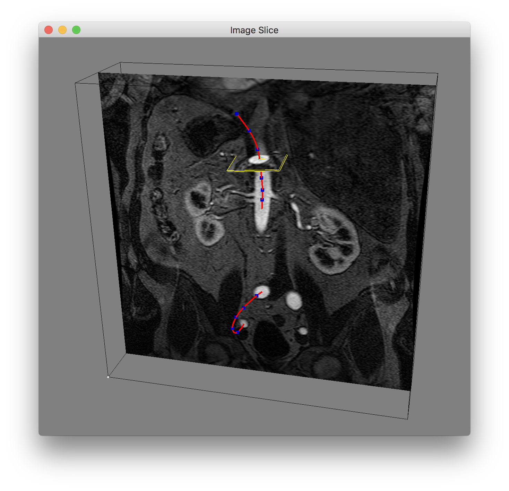

# Image Slicer

This Python code is used to test for extracting 2D slices from a 3D image volume using VTK.

Slices are extracted using
1) Volume axes
2) Points along a SimVascular path: position, tangent and normal to a path line.

# Slicing volume axes
Extracting and displaying a 2D slice along a volume ijk axis is performed using **vtkLookupTable**, **vtkImageMapToColors** and **vtkImageActor** classes. 

# Slicing using a SimVascular path

A SimVascular path is an interpolating spline through a set of control points. Each point along a path contains a position and vectors defining the tangent and normal to the path at that position. This data is used to define a 2D plane oriented in 3D. I tried three methods to extract a 2D slice

1) Use **vtk.vtkImageReslice** to extract volume data on the 2D slice (see **Image.extract_slice_bad**). This method requires setting a bunch of parameters (AxesOrigin, AxesDirectionCosines, OutputSpacing and OutputOrigin) whose meaning is not very clear, not really any documentation for this. I never got this to work.

2) Use **vtk.vtkPlane**, **vtk.vtkImageResliceMapper** and **vtk.vtkImageSlice** to extract a 2D slice (see **Image.extract_slice_gut**). This did work but it slices the entire volume on the infinite plane. I could probably use this if I could clip the result.

3) Use **vtk.vtkPolyData** and **vtk.vtkProbeFilter** to inerpolate volume data at points on a finite plane. This worked fine and is what is shown in the image below. 

The image shows a 2D k-axis volume slice. The SimVascular path is shown as a red line with control points (blue markers). A 2D slice has been extract from the image volume by selecting a point on the path. The path position, tangent and normal define a plane used to interpolate image data.

