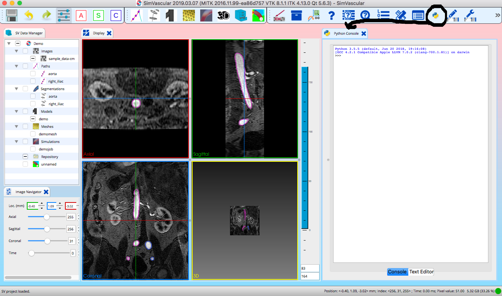
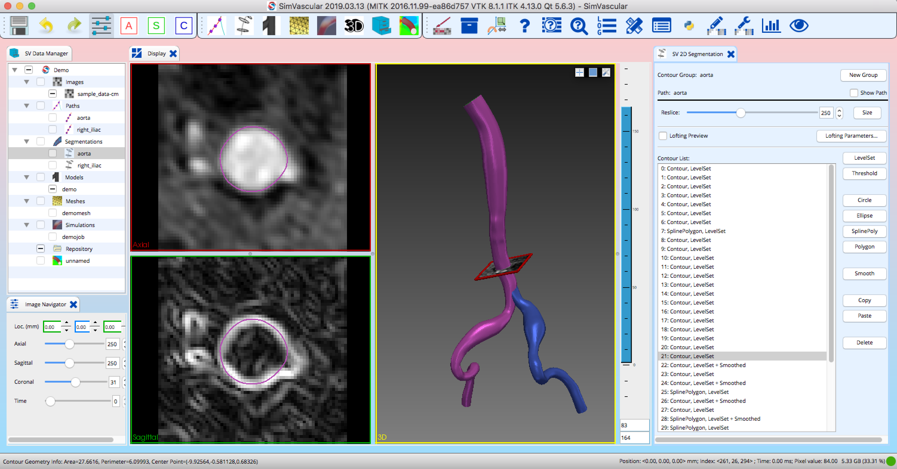
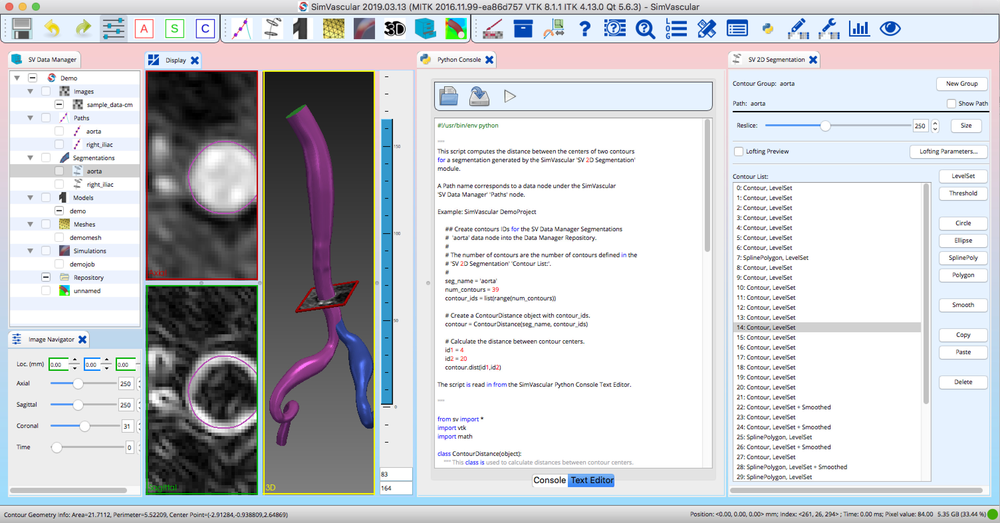
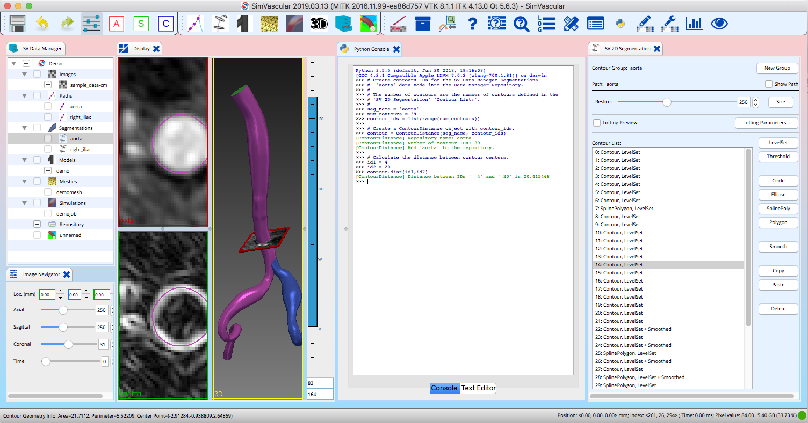

# Executing Python Scripts within the SimVascular GUI  #

This directory contains scripts for applications using the SimVascular Python Scripting Interface. The SimVascular Python Scripting Interface provides an API for accessing data nodes created by SimVascular modules (e.g. ) from the **SV Data Manager**. For example, the **SV Path Planning** module creates data nodes under the **Paths** entry in the **SV Data Manager**.

> Note that the SimVascular Python API is currently being reimplemented to be more Pythonic. Stay tuned!

The SimVascular Python Scripting Interface is accessed from the GUI by selecting the  icon from the SimVascular toolbar. This brings up the **Python Console**. The **Python Console** has two panels providing two modes of operation: 1) **Console** and 2) **Text Editor**. **Console** panel provides a Python interpreter for interactively exexcuting commands to be typed in at the **>>>** prompt. 

 

Selecting the **Text Editor** button at the bottom of the **Python Console** switches to the **Text Editor** panel.

The **Text Editor** panel is used to load, run and edit a Python script stored in a file. A Python script file is loaded from a file by selecting the  icon located on the top left of the **Python Console**. Once loaded the contents of the Python script are displayed and can be run by selecting the  icon. Select the **Console** button at the bottom of the **Python Console** to switch back to the Python console to see the results of running the script.

Python commands can be interactively editied and the contents of the panel rerun. The modified script can then be written to a file by selecting the  icon.

## List of SimVascular Python Scripts ##

[contour_distance.py](contour_distance.py) - This script computes the distance between the centers of two contours
for a segmentation generated by the SimVascular **SV 2D Segmentation** module.
  
[mesh_info.py](mesh_info.py) - This script prints mesh information for a mesh created by the SimVascular **SV Meshing** tool.
  
[path_distance.py](path_distance.py) - This script computes the distance between two control points
on a path created by the SimVascular **SV Path Planning** module. **WARNING**: This script will not work with the current SimVascular release because it does not yet have the **GetControlPts()** function implemented.

## Example 1 - Calculating the Distances between Contours for the SimVascular Demo Project
This example demostrates how to use the **contour_distance.py** script to calculating the distances between contours for the SimVascular [Demo Project](http://simvascular.github.io/docsQuickGuide.html#segmentation) which can be downloaded from [here](https://simtk.org/frs/download_confirm.php/file/5113/DemoProject.zip?group_id=930). 

Start SimVascular and open the **Demo Project**. From the **SV Data Manager** select the **aorta** data node under  **Segmentations**. You should now see the panel for the **SV 2D Segmentation** module. 

<figure>

<figcaption>SimVascular SV 2D Segmentation Panel </figcaption>
</figure>
   
                                                                                                        
The **Contour List:** browser displays a list of segmentation contours number 0 to 38. Now open the SimVascular **Python Console**, select the **Text Editor** button at the bottom of the panel, read in the **contour_distance.py** script and run it.

<figure>

<figcaption>Python Console showing contour distance script.  </figcaption>
</figure>
   

Now copy and paste the following Python commands into the **Console** panel

    # Create contours IDs for the SV Data Manager Segmentations 
    #  'aorta' data node into the Data Manager Repository.
    #
    # The number of contours are the number of contours defined in the
    # 'SV 2D Segmentation' 'Contour List:'. 
    #
    seg_name = 'aorta'
    num_contours = 39
    contour_ids = list(range(num_contours))

    # Create a ContourDistance object with contour_ids.
    contour = ContourDistance(seg_name, contour_ids)

    # Calculate the distance between contour centers.
    id1 = 4
    id2 = 20
    contour.dist(id1,id2)
     
The commands create a **ContourDist** Python object called **contour** that is used to store information about the contours for the given segment. Its **dist** function the distance between the contours with **id1** and **id2**. The IDs are the same IDs displayed in the **Contour List:** browser.

<figure>

<figcaption>Python Console showing how to calculate distances using a ContourDistance object.  </figcaption>
</figure>
   

# Executing Python Scripts from the Command Line  #

SimVascular can also run a Python script from the command line. This requires running a shell script that executes SimVascular from a terminal. SimVascular is executed from the command line using

Linux: /usr/local/sv/simvascular/DATE/simvascular                      DATE is the install date (e.g. 2019-08-09).
MacOS: /Applications/SimVascular.app/Contents/MacOS/SimVascular

You can then execute a Python script using 

/usr/local/sv/simvascular/DATE/simvascular --python -- SCRIPT

